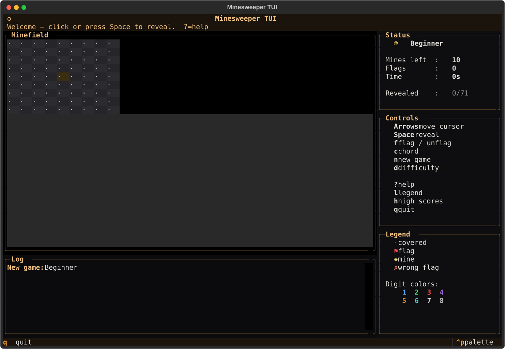
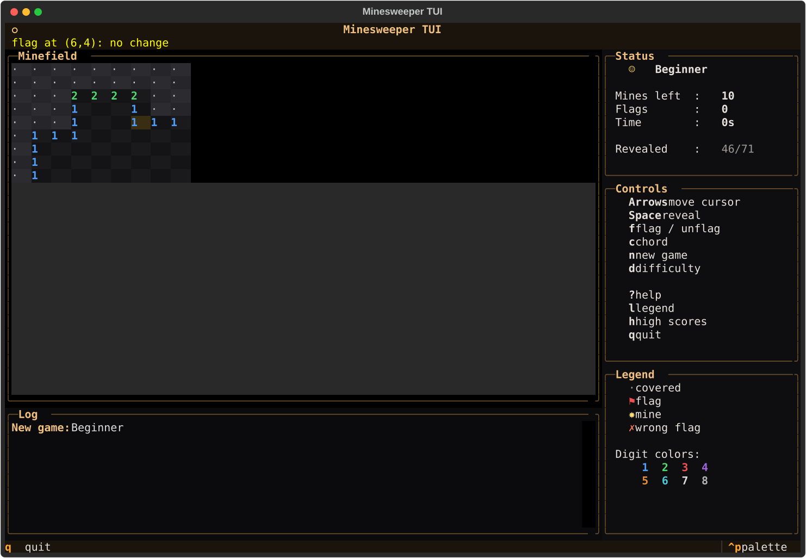
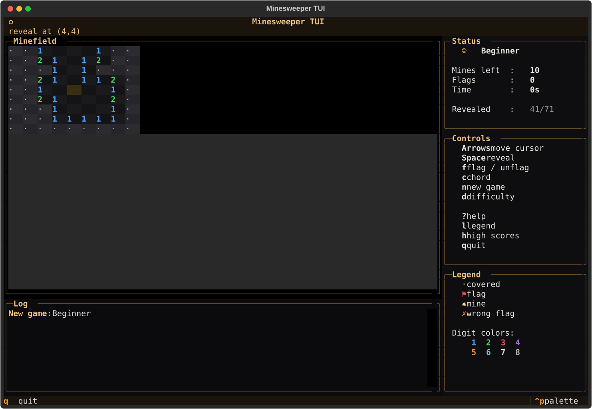

# minesweeper-tui
Flag the mines. Clear the board.





## About
The grid remembers everything. Beginner, Intermediate, Expert — or roll your own board. Left to reveal, right to flag, middle to chord, mouse or keyboard. Live timer, highscore list, REST agent API for the bots. The classic first-click-is-safe logic puzzle that has eaten a decade of lunch breaks.

## Screenshots


## Install & Run
```bash
git clone https://github.com/akakabrian/minesweeper-tui
cd minesweeper-tui
make
make run
```

## Controls
| Key               | Action                                      |
|-------------------|---------------------------------------------|
| Arrows / Home/End / PgUp/PgDn | move cursor                         |
| Space / Enter     | reveal cell                                  |
| `f`               | toggle flag                                  |
| `c`               | chord (reveal safe neighbours of a number)   |
| `n`               | new game (same difficulty)                   |
| `d`               | pick difficulty                              |
| `?`               | help                                         |
| `l`               | legend                                       |
| `h`               | high scores                                  |
| `q`               | quit                                         |
| Left click        | reveal                                       |
| Right click       | flag                                         |
| Middle click      | chord                                        |

### Flags

| Flag                 | Effect                                          |
|----------------------|-------------------------------------------------|
| `--sound`            | enable synth SFX (reveal / flag / chord / …)    |
| `--seed N`           | deterministic board (for repro / testing)       |
| `--agent`            | run the REST agent API alongside the TUI        |
| `--headless`         | agent API only, no TUI                          |
| `--host H --port P`  | override API bind address (default 127.0.0.1:8765) |

## Testing
```bash
make test       # QA harness
make playtest   # scripted critical-path run
make perf       # performance baseline
```

## License
MIT

## Built with
- [Textual](https://textual.textualize.io/) — the TUI framework
- [tui-game-build](https://github.com/akakabrian/tui-foundry) — shared build process
